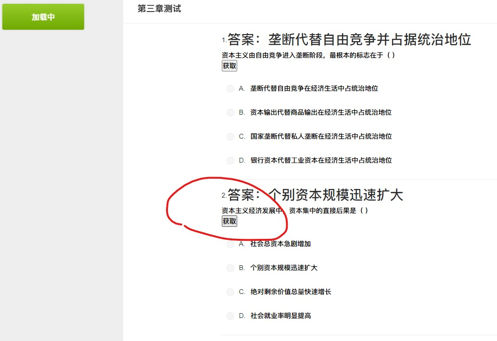

# 智慧树 自动搜题 Chrome 插件——不定期更新
## 点个star再走呗😘，star过100开发小程序版
**watch获取更新信息，需要支持其他平台,加群交流457053357**
智慧树 网课自动 答题 插件 和超新慕课功能类似 题库更全
## 特性

- 自动搜素题目答案，无需手动搜题
- 题库超全，覆盖广

## 注意

_本插件依旧在开发中，如果出现问题请在 **issue** 中提出_

## 用户统计 （2020年5月2日）

## 更新说明

### 2020-4月11号 
**老版本如果不更新将无法使用！！！**
> 优化搜题流程和速度支持https

完善功能

### 2020-3月30号
**国内备用下载地址见issues**

> ~~为了提高答案的爬取效率，答案会从 __最后一题__ 进行获取
如果 __搜题api出现问题__ 会出现 __无答案，可点击再次获取答案__~~

## 使用说明

### 浏览器

最新 Chrome 浏览器 或者 ChromeEdge 。

> 经测试在 Chrome `版本 58.0.3029.110 (64-bit)` 以及 ChromeEdge 下可用。

### 操作步骤 （chromeEdge）

1. 下载 **Releases** 中的 **autoGetProblem.zip** 并解压

2. 进入 **拓展** ，打开浏览器的 **开发人员模式** 选项

3. 点击 **解压缩的拓展** 并选择之前解压缩的文件夹

4. 打开 **智慧树** 题目测试页面

> ~~需更改网站为 **http** ，否则插件无法获取到答案！！~~

5. 点击~~右下角 **点击搜题**~~ 题目附近的获取即可

6. 等待几秒钟，即可获取答案

