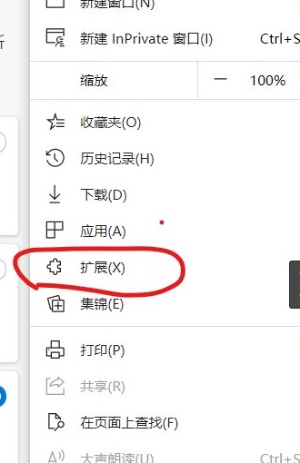
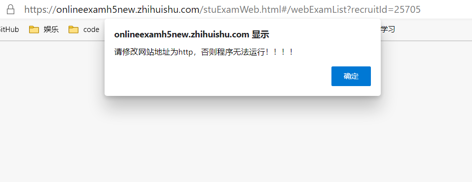

# 智慧树 自动搜题 Chrome 插件
智慧树 网课自动 答题 插件 和超新慕课功能类似 题库更全
## 特性

- 自动搜素题目答案，无需手动搜题
- 题库超全，覆盖广

### 注意

_本插件依旧在开发中，如果出现问题请在 **issue** 中提出_

## 最新说明 2020-3月30号
> 为了提高答案的爬取效率，答案会从 __最后一题__ 进行获取
如果 __搜题api出现问题__ 会出现 __无答案，可点击再次获取答案__ 

## 使用说明

### 浏览器

最新 Chrome 浏览器 或者 ChromeEdge 。

> 经测试在 Chrome `版本 58.0.3029.110 (64-bit)` 以及 ChromeEdge 下可用。

### 操作步骤 （chromeEdge）

1. 下载 **Releases** 中的 **autoGetProblem.zip** 并解压

2. 进入 **拓展** ，打开浏览器的 **开发人员模式** 选项

3. 点击 **解压缩的拓展** 并选择之前解压缩的文件夹

4. 打开 **智慧树** 题目测试页面

> 需更改网站为 **http** ，否则插件无法获取到答案！！

5. 点击右下角 **点击搜题**

6. 等待几秒钟，即可获取答案

